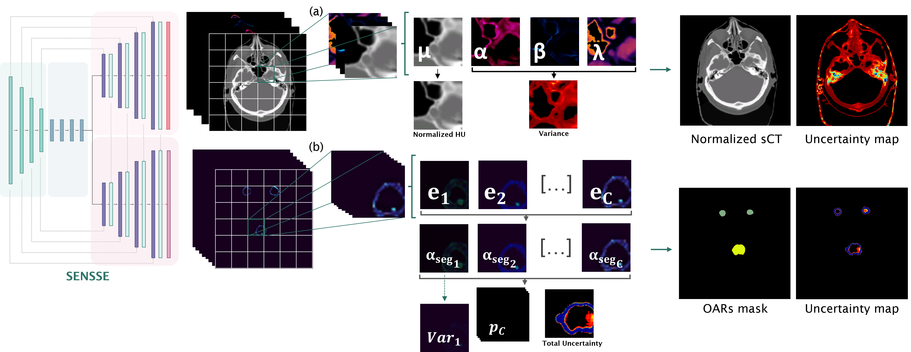
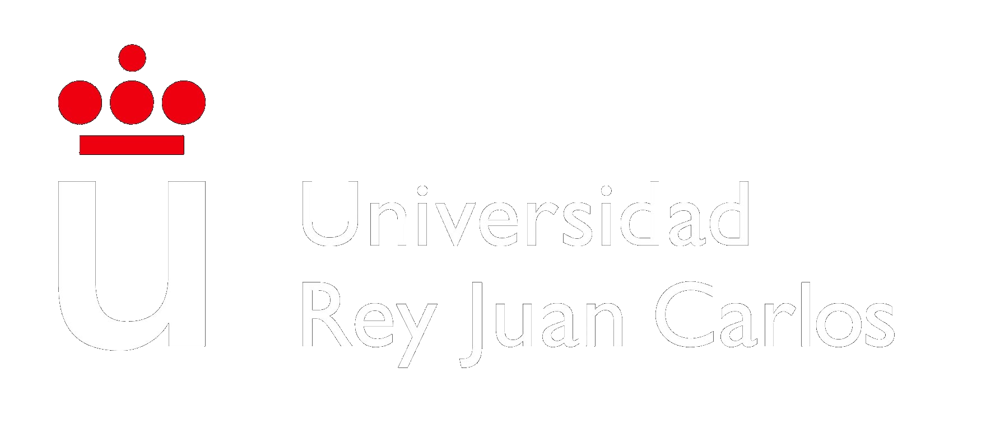

# SENSSE: Simultaneous Evidential Network for Synthesis and Segmentation with Uncertainty Quantification

SENSSE is a deep learning framework for the simultaneous generation of synthetic CT (sCT) images and organ-at-risk (OAR) segmentation masks from cone-beam CT (CBCT) images, while providing uncertainty estimates for both tasks.

The framework combines multitask learning, Evidential Deep Learning (EDL), and Normal-Inverse-Gamma (NIG) regression to jointly perform image synthesis, segmentation, and uncertainty quantification within a unified architecture.

<p align="center">
  
</p>


---

# Overview

Adaptive radiotherapy requires accurate anatomical information for treatment adaptation, dose recalculation and treatment monitoring. Two key components of this workflow are CBCT-to-CT synthesis and organ-at-risk (OAR) segmentation. Although these tasks are strongly interconnected, they are traditionally addressed using independent models, preventing them from exploiting complementary anatomical and intensity information. SENSSE is built upon the hypothesis that image synthesis and segmentation can mutually benefit from being learned simultaneously. While segmentation provides structural and anatomical guidance that can improve synthetic CT generation, image synthesis offers richer intensity information that may facilitate tissue delineation and boundary identification. Jointly learning both tasks encourages the extraction of shared representations that are relevant to adaptive radiotherapy workflows. Beyond multitask learning, SENSSE incorporates uncertainty quantification for both synthesis and segmentation. 

SENSSE hey features include:

- Performing CBCT-to-CT synthesis and OAR segmentation simultaneously.
- Modeling uncertainties for both tasks through evidential deep learning, without requiring sampling approaches.
- Supporting configurable 2D and 2.5D inputs.
- Providing a modular framework for training, inference, evaluation, and uncertainty analysis.
  
---

# Scope and Objectives

The repository aims to provide a reproducible framework for:

- Simultaneous CBCT-to-CT synthesis and OAR segmentation.
- Uncertainty-aware medical image analysis.
- Investigation of evidential learning methods for image synthesis and segmentation.
- Development of adaptive radiotherapy workflows.

---

# Repository Structure

```text
SENSSE/

├── configs/
│   └── example_config.yaml
│
├── evidential_deep_learning/
│
├── experiments/
│   ├── ablation_connections.py
│   ├── ablation_regularization.py
│
├── sensse/
│   ├── datasets/
│   ├── losses/
│   ├── metrics/
│   ├── models/
│   ├── uncertainty/
│   └── utils/
│
├── train.py
├── inference.py
├── evaluate.py
│
├── requirements.txt
├── LICENSE
└── README.md
```

---

# Quick Start

## Training

```bash
python train.py \
    --config configs/example_config.yaml
```

## Inference

```bash
python inference.py \
    --config configs/example_config.yaml
```

---

# Documentation

Detailed documentation is provided in the `docs/` folder.

| Document | Description |
|-----------|-------------|
| `dataset_preparation.md` | Dataset structure, preprocessing and normalization |
| `technical_details.md` | Architecture, losses and implementation details |
| `metrics.md` | Mathematical definitions of all evaluation metrics |
| `results.md` | Summary of experimental results and ablation studies |

---


# Citation

If you use SENSSE in your research, please cite:

The citation will be updated once the manuscript is formally published.

---

# Acknowledgements

This work was developed by the **PROMISE Research Group** at **Universidad Rey Juan Carlos** in collaboration with the **Centro de Protonterapia Quirónsalud**.
This study has been funded by the MAGERIT-CM project (TEC-2024/COM-44), funded by Comunidad de Madrid.

<p align="center">

&nbsp;&romise_logo.png" alt="PROMISE Researchs/images/cpt_logo.png" alt="Centro de Protonterapia Quirónsaludgo.png" alt="MAGERIT-CM" height="70
