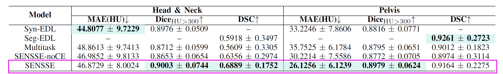
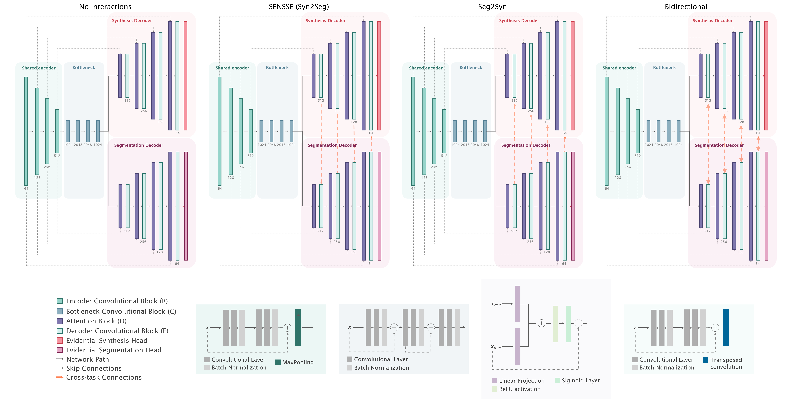
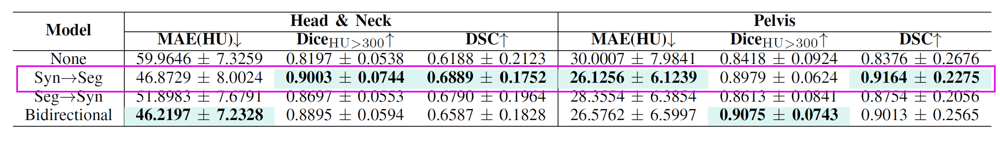
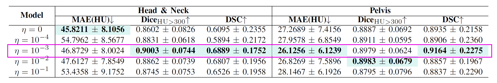

<h1 align="center">Ablation Studies</h1>

SENSSE integrates multiple architectural and methodological components, each designed to address a specific aspect of the framework. These components include multitask learning, evidential learning strategies, decoder interaction mechanisms and uncertainty-aware regularization terms, all of which contribute to the final model performance.

To better understand the individual contribution of each design choice, a series of ablation studies was conducted. Rather than focusing exclusively on overall performance, these experiments aim to investigate the role of each component and quantify its impact on image synthesis quality, anatomical segmentation accuracy, and uncertainty estimation.

Three complementary ablation studies were performed. First, a **Component Ablation** analyses the contribution of the main architectural elements composing the SENSSE framework. Second, a **Connection Ablation** evaluates different decoder interaction strategies and their influence on information exchange between synthesis and segmentation tasks. Finally, a **Regularization Ablation** investigates the effect of evidential regularization on predictive performance and uncertainty estimation. Together, these experiments provide a assessment of the design decisions underlying SENSSE and offer insights into the mechanisms responsible for its performance.

---

# Component Ablation

SENSSE combines several key components, including multitask learning, evidential learning for synthesis and segmentation, decoder interactions and auxiliary optimization objectives. While the complete framework integrates all these elements simultaneously, it is important to determine the individual contribution of each component. The purpose of the component ablation study is therefore to answer the following questions:

- Does multitask learning provide a benefit compared to single-task models?
- Is simultaneous optimization preferable to independent synthesis and segmentation networks?
- Does the auxiliary cross-entropy loss improve evidential segmentation?
- What is the contribution of the complete SENSSE formulation?

To investigate these questions, we compare the full SENSSE framework against a series of simplified variants in which individual components are removed.

## Evaluated Models

  

### Syn-EDL
This model isolates the image synthesis task by removing the segmentation branch and training the network exclusively for synthetic image generation supported by evidential deep learning. The objective of this experiment is to establish a synthesis-only baseline and evaluate the extent to which image reconstruction benefits from the multitask framework proposed in SENSSE. 

### Seg-EDL
This configuration focuses exclusively on anatomical segmentation by removing the synthesis branch. The resulting model provides a segmentation-only baseline that enables the contribution of multitask learning to be quantified. Evidential Deep Learning remains the underlying segmentation framework, allowing evaluation of segmentation performance and uncertainty estimation without any influence from image synthesis.

### Multitask
This model simultaneously performs image synthesis and segmentation using a shared encoder and dual-decoder architecture, but without evidential learning or decoder interaction mechanisms. By jointly optimizing both tasks while removing the uncertainty-aware components of SENSSE, this experiment allows the isolated contribution of multitask learning to be evaluated.

### SENSSE-noCE

This variant corresponds to the complete SENSSE framework with the exception of the auxiliary cross-entropy loss incorporated into the segmentation objective. The purpose of this experiment is to investigate whether explicit probabilistic supervision contributes to improved optimization, segmentation accuracy and evidential learning stability when combined with the EDL formulation.

### SENSSE
SENSSE represents the complete proposed framework

---

## Results

  

SENSSE framework provides the most balanced performance across image synthesis and segmentation tasks. While single-task models achieve competitive results within their respective domains, jointly learning both tasks enables the model to exploit complementary information and improve overall performance. Furthermore, the comparison between Multitask, SENSSE-noCE and the full SENSSE configuration highlights the contribution of uncertainty-aware learning and auxiliary supervision to the final performance.

  

Qualitative examples further illustrate the benefits of joint learning. Compared with simpler architectures, SENSSE produces synthetic images with improved anatomical consistency while simultaneously generating more accurate segmentation masks, particularly in challenging regions exhibiting low tissue contrast or complex anatomical boundaries.

---

# Connection Ablation
A central hypothesis of SENSSE is that image synthesis and segmentation are complementary tasks that can benefit from exchanging information during feature reconstruction. While both branches already share encoder representations, the proposed architecture further enables feature transfer at the decoder level, allowing task-specific information to be propagated between reconstruction pathways.

The purpose of this ablation study is to investigate the effect of different decoder interaction strategies and determine whether information exchange improves performance compared with completely independent decoders. In particular, this experiment aims to answer the following questions:

- Does feature sharing during decoding improve synthesis and segmentation performance?
- Is synthesis more useful for segmentation than segmentation is for synthesis?
- Does bidirectional information exchange provide additional benefits?
- Which interaction strategy achieves the best balance between both tasks?

To answer these questions, four interaction configurations were evaluated.

## Evaluated Interaction Strategies

  

### None

In this configuration, the synthesis and segmentation decoders operate completely independently after the shared encoder. Although both tasks benefit from common encoder representations, no information is exchanged during reconstruction. This experiment serves as the baseline against which all interaction mechanisms are compared.

### Syn2Seg

Feature maps generated by the synthesis decoder are transferred to the segmentation branch at each decoder level. The underlying hypothesis is that intensity-related information learned during image reconstruction can facilitate anatomical delineation by providing additional contextual information regarding tissue appearance and boundaries.

### Seg2Syn

Feature maps generated by the segmentation decoder are transferred to the synthesis branch. This experiment evaluates whether structural and anatomical information can guide image reconstruction and improve the anatomical consistency of synthesized images.

### Bidirectional

Information is exchanged simultaneously in both directions, allowing synthesis and segmentation to continuously interact throughout the decoding process. This configuration investigates whether maximal feature sharing further enhances performance or introduces competition between tasks.

---

## Results

  

The introduction of decoder interactions consistently improves performance compared with completely independent decoders, confirming that synthesis and segmentation benefit from information exchange during reconstruction. The absence of interactions results in the lowest performance in almost all metrics across both datasets, demonstrating that simply sharing encoder representations is insufficient to fully exploit the complementary nature of both tasks.

Among all evaluated strategies, the Syn2Seg configuration achieves the most balanced overall performance. For the Head & Neck dataset, it substantially improves segmentation accuracy compared with the interaction-free baseline while simultaneously reducing synthesis error. Similar trends are observed in the Pelvis dataset, where Syn2Seg achieves the highest segmentation performance and one of the lowest synthesis errors. These findings support the central hypothesis of SENSSE, that is, intensity-related information learned during image synthesis provides valuable guidance for anatomical segmentation.

The Seg2Syn strategy also improves performance over the baseline, but the gains are generally smaller than those obtained with Syn2Seg. While anatomical information can assist image reconstruction, segmentation features primarily encode structural information and may not provide sufficient intensity-related detail to substantially improve synthesis quality. Consequently, the resulting improvements are more limited.

Interestingly, the Bidirectional configuration achieves the lowest synthesis error on the Head & Neck dataset, suggesting that anatomical priors can contribute to more accurate image reconstruction. However, these gains are not consistently translated into segmentation performance, and in several cases the bidirectional strategy performs slightly worse than Syn2Seg. A possible explanation is that simultaneous feature exchange in both directions increases optimization complexity and may introduce conflicting task-specific information during reconstruction.

Overall, the results indicate that decoder interactions are beneficial, but the direction of information transfer plays an important role. Transferring synthesis features towards the segmentation branch provides the most consistent improvements across datasets and tasks, supporting the design choice adopted in the final SENSSE architecture.

  

Qualitative examples further illustrate these findings. Compared with independent decoders, interaction-based models produce segmentations with improved anatomical consistency and more accurate boundary delineation. In particular, the Syn2Seg configuration generates cleaner contours in regions with low soft-tissue contrast, suggesting that synthesis-derived intensity information helps the model identify challenging anatomical transitions. At the same time, synthesized images maintain realistic tissue appearance and anatomical consistency, confirming that decoder interactions can improve segmentation performance without compromising image reconstruction quality.

# Regularization Ablation

Deep Evidential Regression incorporates an evidential regularization term that penalizes unsupported confidence and encourages uncertainty estimates to remain consistent with prediction errors. The strength of this regularization is controlled through the parameter $\eta$ which determines the relative influence of the evidential constraint during optimization.

Selecting an appropriate value for this parameter is critical. If regularization is too weak, the network may generate overconfident predictions despite large reconstruction errors. Conversely, excessive regularization may force the model to remain unnecessarily uncertain, potentially degrading synthesis quality and adversely affecting downstream segmentation performance.

The purpose of this ablation study is therefore to investigate the influence of evidential regularization on both tasks and identify an appropriate trade-off between predictive performance and uncertainty awareness. In particular, this experiment aims to answer the following questions:

- Does evidential regularization improve image synthesis quality?
- How sensitive is the model to the selected regularization strength?
- Can uncertainty regularization influence segmentation performance despite being applied only to the synthesis branch?
- Which regularization value provides the most balanced overall behavior?

To answer these questions, multiple values of the evidential regularization coefficient were evaluated.

## Evaluated Configurations

### η = 0

This configuration removes evidential regularization entirely, leaving only the negative log-likelihood objective. As a result, the model is optimized exclusively for reconstruction accuracy without explicitly penalizing overconfident predictions. This experiment serves as the baseline.

### η = 10⁻⁴

A weak evidential constraint is introduced during optimization. This setting investigates whether a small amount of regularization is sufficient to improve uncertainty estimation while preserving reconstruction quality.

### η = 10⁻³

This configuration corresponds to the manuscript setting. It represents a moderate regularization strength designed to balance reconstruction accuracy and uncertainty awareness.

### η = 10⁻²

A stronger evidential penalty is applied, forcing the model to be increasingly conservative in its confidence estimates. This experiment evaluates whether additional regularization further improves robustness or begins to interfere with learning.

### η = 10⁻¹

This represents the strongest regularization setting investigated. At this level, uncertainty constraints dominate optimization and may limit the model's ability to fit the underlying intensity distribution.

---

## Results

  

The results reveal that evidential regularization has a substantial impact on both synthesis and segmentation performance. While the regularization term is applied exclusively to the synthesis objective, changes in synthesis behavior propagate through the multitask framework and ultimately influence segmentation quality as well.

The absence of regularization ($\eta=0$) already produces competitive results, indicating that the NIG formulation can successfully learn meaningful reconstructions without additional constraints. However, introducing a moderate regularization term consistently improves overall performance. In particular, the manuscript configuration ($\eta=10^{-3}$) achieves the most balanced behavior across datasets, ranking among the best configurations for both synthesis and segmentation metrics.

Interestingly, very small regularization values ($\eta=10^{-4}$) lead to a noticeable deterioration in synthesis performance. This suggests that weak regularization may be insufficient to effectively constrain unsupported evidence while still perturbing the optimization process. As a consequence, the model does not fully benefit from uncertainty-aware learning.

A moderate regularization strength ($\eta=10^{-3}$) produces the most consistent improvements. At this level, evidential constraints effectively discourage overconfident predictions while preserving the ability of the network to accurately model image intensities. Improved synthesis quality subsequently benefits the segmentation branch through the decoder interaction mechanism, leading to competitive segmentation performance across both datasets.

Increasing the regularization strength further ($\eta=10^{-2}$) results in a slight degradation of reconstruction accuracy. Although uncertainty estimates remain meaningful, the stronger penalty begins to restrict the flexibility of the synthesis model, producing a less favorable balance between accuracy and uncertainty awareness.

Finally, the strongest regularization setting ($\eta=10^{-1}$) consistently degrades performance. Excessive penalization encourages the model to remain overly conservative and prevents effective fitting of the target intensity distribution. Since segmentation relies on information propagated from the synthesis branch, reduced synthesis quality also negatively impacts anatomical delineation.

Overall, the results demonstrate that evidential regularization constitutes a critical component of SENSSE. Moderate values improve both predictive performance and uncertainty behavior, whereas insufficient or excessive regularization can hinder optimization. The selected manuscript configuration ($\eta=10^{-3}$) provides the most favorable compromise between synthesis accuracy, segmentation performance, and uncertainty-aware learning.

*TODO: Insert Image*

Qualitative results further support these observations. Models trained with little or no regularization tend to produce uncertainty maps that are less correlated with reconstruction errors, whereas excessively regularized models generate overly diffuse uncertainty estimates together with smoother image predictions. In contrast, the manuscript configuration produces uncertainty distributions that better align with reconstruction errors while preserving anatomical detail and image quality, highlighting the importance of appropriately balancing predictive accuracy and evidential constraints.
