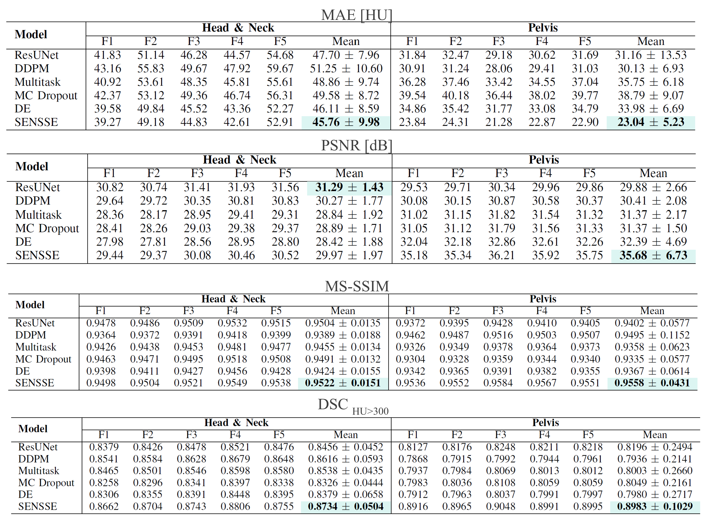
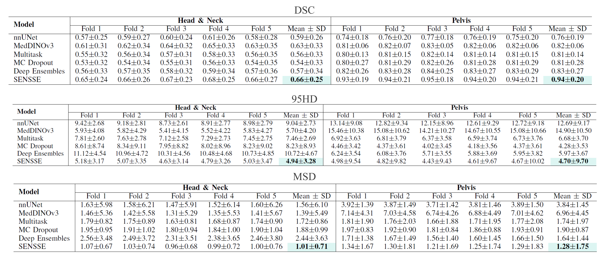

<h1 align="center">SENSSE Extended Results</h1>

This document provides additional experimental results that complement the analyses presented in the manuscript. These results are included to improve transparency and reproducibility while keeping the main paper concise and focused on the primary findings.

---

# Fold-wise Results

All primary experiments reported in the manuscript were evaluated using a five-fold cross-validation protocol. While the paper reports aggregated statistics (mean ± standard deviation), the following tables present the results obtained on each individual fold.

## Sythesis Results
The following tables summarize the fold-wise performance obtained for sCT generation in the Head & Neck and Pelvis datasets. For each model, results from the five evaluation folds are reported together with the overall mean and standard deviation used in the main manuscript.

  

The fold-wise analysis demonstrates that the observed trends remain consistent across data partitions. While some variability is expected due to the limited dataset size and anatomical heterogeneity, the ranking of the evaluated methods is largely preserved throughout the folds. SENSSE consistently achieves competitive performance across all evaluated synthesis metrics.

The variability observed between folds is more pronounced in the Head & Neck cohort than in the Pelvis dataset. This behavior is expected given the increased anatomical complexity of the head and neck region and the larger inter-patient variability. In contrast, results in the pelvic cohort are generally more stable, reflecting the lower anatomical variability and more homogeneous imaging characteristics.

Beyond the aggregated metrics reported in the manuscript, the fold-wise results confirm that the improvements obtained by SENSSE are not driven by a particular train-test split. Instead, the proposed framework demonstrates consistent synthesis quality across different data partitions, suggesting good robustness and generalization capabilities.

Interestingly, although some competing approaches achieve strong performance in specific folds, their behavior is less consistent across the complete evaluation. In contrast, SENSSE exhibits relatively stable performance while maintaining the best overall results in most metrics. This indicates that jointly learning synthesis and segmentation, together with evidential supervision, provides a robust training signal that remains effective across different subsets of the data.

## Segmentation Results

Next tables report fold-wise segmentation performance for both datasets. Due to the substantial variability in organ sizes and anatomical complexity, each fold is summarized using the mean and standard deviation calculated across all evaluated patients and structures within that fold. The reported values therefore provide complementary information regarding both segmentation accuracy and performance variability. While the mean reflects the average delineation quality, the associated standard deviation captures the heterogeneity introduced by structures ranging from large organs to very small anatomical regions

  

---

Across both anatomical sites, SENSSE consistently achieves the highest Dice Similarity Coefficient together with the lowest boundary-based errors. Importantly, these improvements are observed not only in the aggregated results but also across individual folds, indicating that the performance gains are reproducible and not restricted to a particular data partition.

As expected, variability is substantially larger in the Head & Neck cohort. This region contains several small and low contrast OARs, including the optic nerves, optic chiasm, cochleae, and pituitary gland, which are known to present significant segmentation challenges. Consequently, fold fluctuations are more noticeable than in the pelvic dataset. Nevertheless, SENSSE maintains superior performance across all folds. The pelvic dataset exhibits both higher Dice scores and reduced variability. This behavior reflects the larger size and better visibility of the evaluated structures. 

Overall, the fold-wise analysis supports the findings presented in the main manuscript, demonstrating that the proposed multitask evidential framework achieves robust and reproducible segmentation performance across multiple data partitions and anatomical regions.

